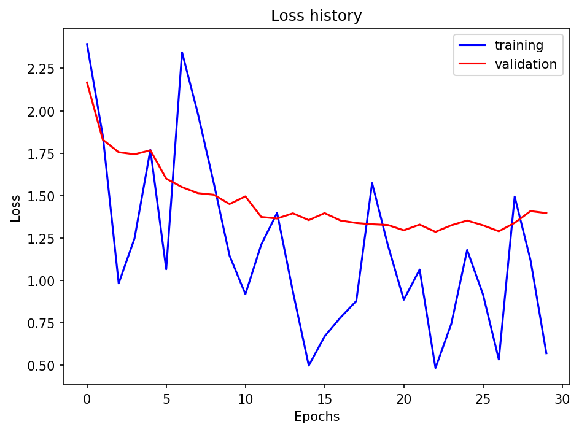
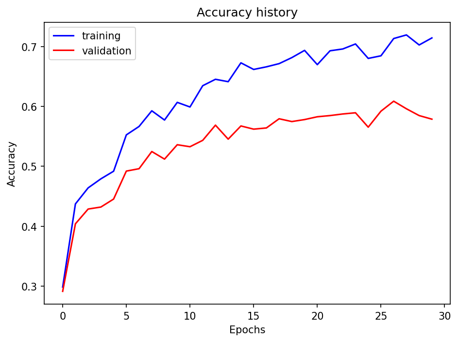
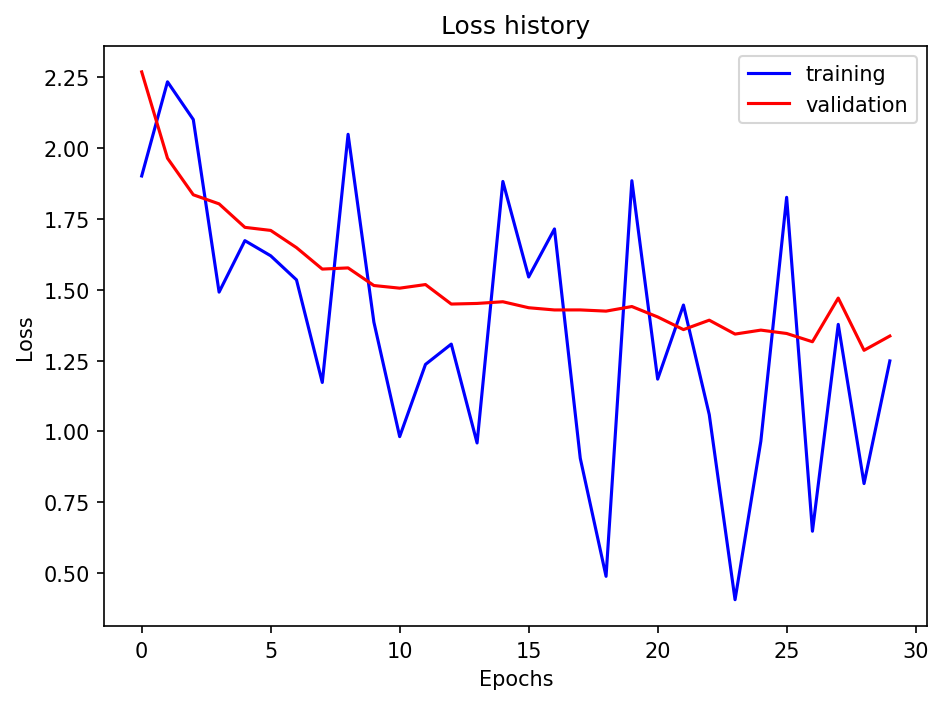
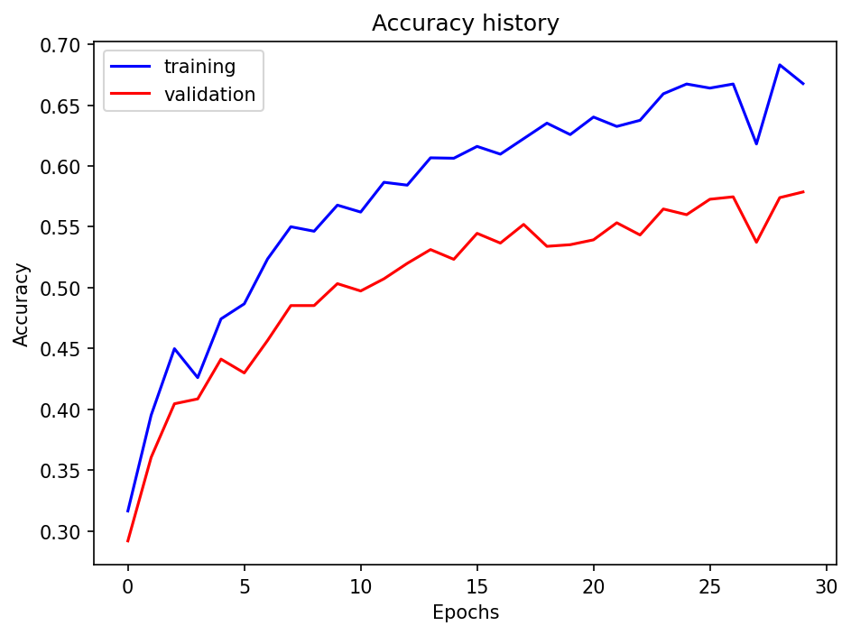
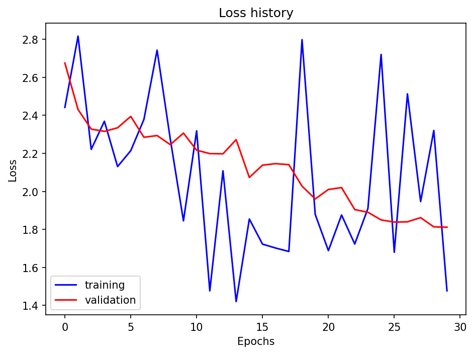
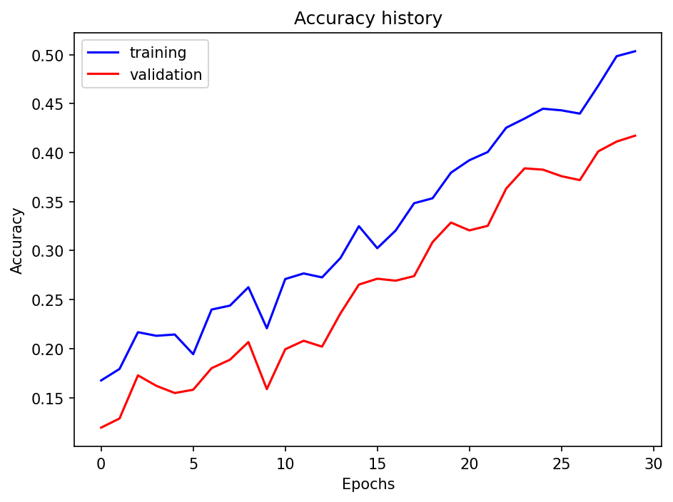
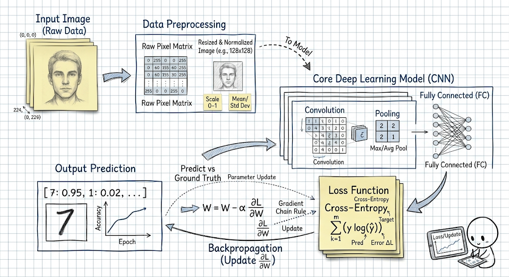

<div align="center">

# 🔧 场景识别深度学习训练系统
### Scene Recognition Deep Learning Training System

[](https://github.com/airprofly/siftRecognition/tree/feature/deeplearning) [](https://github.com/airprofly/siftRecognition/stargazers) [](https://opensource.org/licenses/MIT)

[](https://www.python.org/downloads/) [](https://pytorch.org/) [](https://numpy.org/)

深度学习 · 场景识别 · PyTorch · 数据增强

</div>

---

## 📖 项目简介

基于 PyTorch 实现的场景识别深度学习训练系统，支持多种神经网络架构（SimpleNet、Dropout、AlexNet）的自动化训练、评估与可视化。系统提供完整的数据增强流水线、灵活的配置管理和详细的训练日志输出。

## 📌 功能特性

- ✅ **多种模型架构**：支持 SimpleNet、SimpleNetDropout、MyAlexNet 三种网络
- ✅ **数据增强流水线**：提供数据增强和基础变换两种预处理模式
- ✅ **自动化训练流程**：配置驱动的批量训练，自动保存检查点和结果
- ✅ **可视化分析**：自动生成损失曲线和准确率图表
- ✅ **灵活配置系统**：支持 YAML 配置文件，数据类类型安全
- ✅ **完整日志系统**：基于 Loguru 的结构化日志输出

## 📁 项目结构

<details>
<summary><b>查看目录结构</b></summary>

```text
proj4/
├── configs/              # 🔧 配置模块
│   ├── __init__.py
│   ├── app_config.py     # 应用配置（路径、运行时、模型、优化器、训练、日志）
│   ├── app_config.yml    # 默认配置文件
│   ├── logger_config.py  # 日志配置
│   └── plt_config.py     # 绘图配置
├── data/                 # 💾 数据集
│   ├── train/           # 训练集（15 类场景）
│   └── test/            # 测试集
├── outputs/             # 📊 训练输出
│   └── <timestamp>/    # 🏷️ 按时间戳组织
│       ├── checkpoints/ # 💾 模型检查点与图表
│       │   ├── simple/  # SimpleNet 训练结果
│       │   ├── dropout/ # SimpleNetDropout 训练结果
│       │   └── alexnet/ # MyAlexNet 训练结果
│       └── logs/        # 📝 训练日志
├── schemas/             # 📝 配置 Schema
│   └── app_config.schema.json
├── src/                 # 🔧 核心源代码
│   ├── __init__.py
│   ├── data_transforms.py    # 数据变换和增强
│   ├── dl_util.py           # 深度学习工具函数
│   ├── image_loader.py      # 图像数据加载器
│   ├── my_alexnet.py        # AlexNet 实现
│   ├── optimizer.py         # 优化器配置
│   ├── runner.py            # 训练与评估流程
│   ├── simple_net.py        # 简单卷积网络
│   ├── simple_net_dropout.py # 带 Dropout 的简单网络
│   └── stats_helper.py      # 数据集统计工具
├── tests/               # 🧪 测试代码
│   ├── conftest.py
│   ├── test_datatransforms.py
│   ├── test_dl_util.py
│   ├── test_image_loader.py
│   ├── test_model.py
│   ├── test_simplenet.py
│   └── test_status_helper.py
├── docs/                # 📖 实验报告（LaTeX 源码与图表）
├── main.py              # 🚀 主程序入口
├── environment.yml      # 📄 Conda 环境配置
├── requirements.txt     # 📄 pip 依赖
└── README.md            # 📄 项目说明
```

</details>

## 🔧 环境配置

<details>
<summary><b>查看环境配置</b></summary>

### 前置要求
- Python 3.12+
- CUDA 11.0+（可选，用于 GPU 加速）

### 创建虚拟环境

**使用 Conda（推荐）**：
```bash
# 创建虚拟环境
conda env create -f environment.yml
conda activate scene_recognition
```

**使用 venv**：
```bash
# 创建虚拟环境
python -m venv venv
source venv/bin/activate  # Linux/Mac
# 或 venv\Scripts\activate  # Windows

# 安装依赖
pip install -r requirements.txt
```

### 核心依赖

| 依赖 | 版本 | 用途 |
|------|------|------|
| PyTorch | 2.9+ | 深度学习框架 |
| torchvision | 0.24+ | 计算机视觉工具 |
| NumPy | 2.3+ | 数值计算 |
| Pillow | 12.0+ | 图像处理 |
| scikit-learn | 1.8+ | 机器学习工具 |
| matplotlib | 3.10+ | 可视化 |
| loguru | 0.7+ | 日志系统 |
| PyYAML | 6.0+ | 配置文件解析 |

</details>

## 🚀 快速开始

### 安装依赖

```bash
# 克隆项目
git clone https://github.com/airprofly/siftRecognition.git
cd siftRecognition

# 安装依赖
pip install -r requirements.txt
```

### 运行训练

```bash
# 使用默认配置训练所有模型
python main.py
```

### 自定义配置

创建 `configs/app_config.yml` 文件（可选）：

```yaml
paths:
  data_dir: ./data
  output:
    output_dir: ./outputs
    checkpoint_dir: checkpoints
    figure_dir: figures

runtime:
  device: cuda  # 或 cpu
  batch_size: 32
  num_workers: 4

model:
  input_size: [64, 64]
  num_classes: 15
  dropout_rate: 0.5

optimizer:
  optimizer_type: adam  # 或 sgd
  lr: 0.001
  weight_decay: 0.0001

training:
  models: [simple, dropout, alexnet]
  num_epochs: 30

logging:
  log_dir: ./outputs
  level: INFO
```

### 参数调优建议

| 参数 | 推荐值 | 说明 |
|------|--------|------|
| `input_size` | (64, 64) 或 (128, 128) | 更高分辨率提升精度但增加计算量 |
| `batch_size` | 16 ~ 128 | GPU 内存越大可选值越大 |
| `lr` | 1e-4 ~ 1e-3 | Adam 建议较小值，SGD 可稍大 |
| `num_epochs` | 20 ~ 50 | 根据数据集大小和模型复杂度调整 |
| `dropout_rate` | 0.3 ~ 0.7 | 防止过拟合，复杂模型用较高值 |

## 📊 效果展示

### 性能对比

| 模型 | 训练准确率 | 验证准确率 | 参数量 | 训练时间 |
|:------|:---------:|:---------:|:------:|:-------:|
| **SimpleNet** | 71.42% | 57.87% | ~80K | ~3.6min |
| **SimpleNetDropout** | 66.77% | 57.87% | ~80K | ~3.6min |
| **MyAlexNet** | 50.35% | 41.73% | ~3M | ~3.7min |

> 📌 **训练配置**：Adam 优化器 (lr=0.001)，Batch Size=32，30 Epochs，输入尺寸 64×64

### SimpleNet

| 损失曲线 | 准确率曲线 |
|:---:|:---:|
| <a href="outputs/2026-05-09_10-37-24/checkpoints/simple/loss_history.png" target="_blank"></a> | <a href="outputs/2026-05-09_10-37-24/checkpoints/simple/accuracy.png" target="_blank"></a> |

### SimpleNetDropout

| 损失曲线 | 准确率曲线 |
|:---:|:---:|
| <a href="outputs/2026-05-09_10-37-24/checkpoints/dropout/loss_history.png" target="_blank"></a> | <a href="outputs/2026-05-09_10-37-24/checkpoints/dropout/accuracy.png" target="_blank"></a> |

### MyAlexNet

| 损失曲线 | 准确率曲线 |
|:---:|:---:|
| <a href="outputs/2026-05-09_10-37-24/checkpoints/alexnet/loss_history.png" target="_blank"></a> | <a href="outputs/2026-05-09_10-37-24/checkpoints/alexnet/accuracy.png" target="_blank"></a> |

## 📚 核心算法



### 模型架构

**SimpleNet**

基础卷积神经网络，包含两层卷积和两层全连接：
- Conv1: 3 → 6 通道，5×5 卷积核
- Conv2: 6 → 16 通道，5×5 卷积核
- FC1: 16×25×4 → 120
- FC2: 120 → 15（15 类场景）

**SimpleNetDropout**

在 SimpleNet 基础上添加 Dropout 正则化：
- 在全连接层后添加 Dropout(p=0.5)
- 有效防止过拟合，提升泛化能力

**MyAlexNet**

经典 AlexNet 架构的简化实现：
- 5 层卷积 + 3 层全连接
- 使用 ReLU 激活函数
- 适合大规模图像分类任务

### 数据增强

系统提供两种数据预处理模式：
- **基础变换**：Resize、ToTensor、Normalize
- **数据增强**：在基础变换上添加 RandomCrop、RandomHorizontalFlip

## 📄 许可证

本项目采用 [MIT 许可证](https://opensource.org/licenses/MIT)。

## 📚 参考文献

1. Alex Krizhevsky, Ilya Sutskever, Geoffrey E. Hinton — [*ImageNet Classification with Deep Convolutional Neural Networks*](https://arxiv.org/abs/1404.5997), NIPS, 2012.
2. Nitish Srivastava, Geoffrey Hinton, Alex Krizhevsky, Ilya Sutskever, Ruslan Salakhutdinov — [*Dropout: A Simple Way to Prevent Neural Networks from Overfitting*](https://www.cs.toronto.edu/~hinton/absps/JMLRdropout.pdf), JMLR, 2014.
