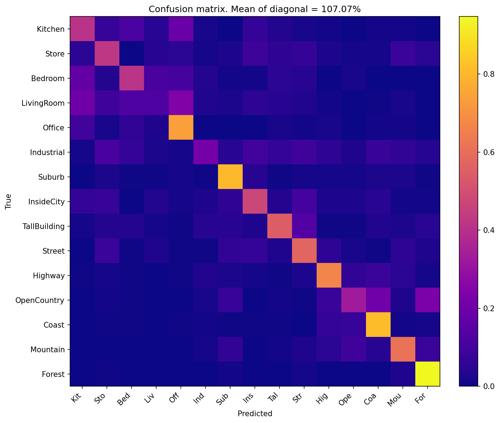

<div align="center">

# 🔧 Harris 角点检测 · SIFT 特征 · 场景识别
### Harris Corner Detection, SIFT Feature Extraction & Scene Recognition

[](https://github.com/airprofly/siftRecognition) [](https://github.com/airprofly/siftRecognition/stargazers) [](https://opensource.org/licenses/MIT)

[](https://www.python.org/downloads/) [](https://pytorch.org/) [](https://scikit-learn.org/)

计算机视觉 · Harris 角点检测 · SIFT 特征 · 场景识别 · PyTorch

</div>

---

## 📖 项目简介

基于 PyTorch 的计算机视觉课程项目，实现三大核心视觉管线：

1. **Harris 角点检测** — 完全基于 PyTorch 自定义层实现
2. **SIFT 特征提取** — 从零实现 SIFT 描述子计算的全流程
3. **场景识别** — 三种分类管线（Tiny Image + k-NN / Bag of SIFT + k-NN / Bag of SIFT + SVM）

数据集：[15 类场景数据集](http://people.csail.mit.edu/torralba/code/spatialenvelope/)，包含 Bedroom、Coast、Forest、Highway、Office 等常见室内外场景。

## 📌 功能特性

- ✅ **HarrisNet** — 纯 PyTorch `nn.Sequential` 构建 Harris 角点检测器
- ✅ **SIFTNet** — PyTorch 自定义层实现 SIFT 特征描述子
- ✅ **特征匹配** — 基于欧氏距离的最近邻匹配与 Lowe 比率测试
- ✅ **k-means 聚类** — 手动实现 k-means++ 初始化的聚类算法
- ✅ **场景识别** — 三条完整管线（Tiny Image / BoF + k-NN / BoF + SVM）
- ✅ **特征缓存** — 自动缓存特征与词表到本地，避免重复计算
- ✅ **混淆矩阵** — 自动生成 15 类分类结果可视化

## 📁 项目结构

<details>
<summary><b>查看目录结构</b></summary>

```text
project/
├── configs/                  # 🔧 配置系统
│   ├── app_config.py         # AppConfig / SceneRecConfig / PathConfig 等
│   ├── app_config.yml        # YAML 配置文件
│   ├── logger_config.py      # loguru 日志配置
│   ├── plt_config.py         # matplotlib 交互配置
│   └── __init__.py           # 全局 APP_CONFIG 单例
├── datasets/
│   ├── __init__.py           # 公开 API：SceneDataset, build_scene_train/test_dataset
│   └── scenedataset.py       # SceneDataset（按类别子目录组织）
├── models/                   # 🧠 模型实现
│   ├── harrisNet.py          # HarrisNet — Harris 角点检测器
│   ├── siftNet.py            # SIFTNet — SIFT 描述子计算
│   ├── feature_match.py      # 特征匹配（距离计算 + 比率测试）
│   ├── kmeans.py             # k-means 聚类与视觉词表构建
│   ├── recognition.py        # 场景识别核心（Tiny Image / BoF / k-NN）
│   └── svm.py                # LinearSVM 分类器
├── utils/
│   ├── utils.py              # 图像 I/O、可视化、评估
│   └── dataloader.py         # Tiny Image 数据加载器
├── tests/                    # 📝 单元测试（pytest）
│   ├── conftest.py           # sys.path 配置
│   ├── test_harris.py        # HarrisNet 各层测试
│   ├── test_sift.py          # SIFT 组件测试
│   ├── test_feature_match.py # 特征匹配测试
│   └── test_recognition.py   # 场景识别完整测试
├── data/                     # 💾 训练/测试数据
│   ├── train/                # 训练集（15 类子目录，每类 100 张）
│   ├── test/                 # 测试集（15 类子目录）
│   ├── vocab_*.npy           # 视觉词表缓存（自动生成）
│   ├── train_tiny.npy        # Tiny Image 训练特征缓存（自动生成）
│   ├── test_tiny.npy         # Tiny Image 测试特征缓存（自动生成）
│   ├── train_bof_*.npy       # BoF 训练特征缓存（自动生成）
│   └── test_bof_*.npy        # BoF 测试特征缓存（自动生成）
├── outputs/
│   └── figures/
│       └── confusion_matrix.png  # 混淆矩阵热力图
├── schemas/
│   └── appConfig.schema.json # YAML 配置 JSON Schema
├── run_scene_recognition.py  # 🚀 场景识别主入口
├── environment.yml           # 💾 Conda 环境配置
└── requirements.txt          # 💾 pip 依赖
```

</details>

## 🔧 环境配置

<details>
<summary><b>查看环境配置</b></summary>

### 前置要求
- 安装 [Miniconda](https://docs.conda.io/en/latest/miniconda.html)

### 创建虚拟环境

```bash
# 使用 Conda（推荐）
conda env create -f environment.yml
conda activate pytorch

# 或使用 pip
pip install -r requirements.txt
```

### 主要依赖

| 依赖 | 版本 |
|------|------|
| Python | 3.12 |
| PyTorch | 2.9+ |
| torchvision | 0.24+ |
| NumPy | 2.3+ |
| scikit-learn | 1.8+ |
| matplotlib | 3.10+ |
| loguru | 0.7+ |

</details>

## 🚀 快速开始

### 场景识别

```bash
conda activate pytorch
python run_scene_recognition.py
```

按顺序执行三条识别管线，输出分类准确率并保存混淆矩阵热力图到 `outputs/figures/` 目录。

### 自定义配置

通过 `configs/app_config.yml` 调整超参数：

| 参数 | 默认值 | 说明 |
|------|--------|------|
| `vocab_size` | 200 | 视觉词表大小（k-means 聚类数） |
| `k_tiny_images` | 3 | Tiny Image 管线 k-NN k 值 |
| `svm_c` | 0.1 | SVM 正则化参数 |
| `num_per_cat` | 100 | 每类训练样本数 |
| `stride` | 20 | 密集 SIFT 采样步长 |

### 运行测试

```bash
# 运行全部测试
python -m pytest tests/

# 测试单个模块
python -m pytest tests/test_harris.py -v
python -m pytest tests/test_sift.py -v
python -m pytest tests/test_recognition.py -v
```

## 📊 实验结果

在 15 类场景数据集（[15 Scene Category Dataset](http://people.csail.mit.edu/torralba/code/spatialenvelope/)）上评估三条识别管线的分类性能。训练集 1500 张（每类 100 张），测试集 2985 张。

### 分类准确率

| 管线 | 特征维度 | 分类器 | 准确率 |
|------|---------|--------|:------:|
| **Tiny Image + k-NN** | 256（16×16 缩略图） | k-NN（k=3） | **8.58%** |
| **Bag of SIFT + k-NN** | 200（词袋直方图） | k-NN（k=15） | **42.31%** |
| **Bag of SIFT + SVM** | 200（词袋直方图） | LinearSVM（C=0.1） | **53.80%** |

### 混淆矩阵

<div align="center">

<a href="outputs/figures/confusion_matrix.png" target="_blank"></a>

</div>

**分析**：
- **Tiny Image 基线**（8.58%）接近随机猜测（~6.67%），说明简单的缩略图特征表达能力有限
- **BoF + k-NN**（42.31%）通过密集 SIFT 局部特征显著提升了分类性能
- **BoF + SVM**（53.80%）使用线性 SVM 替代 k-NN，在 BoF 特征空间中找到更优的分类超平面，相比 k-NN 提升约 11 个百分点
- 混淆矩阵显示多数分类错误集中在语义相似的场景之间（如 Coast / OpenCountry / Mountain 等室外场景）

## 🧠 核心算法

### Harris 角点检测

$$
R = \det(M) - \alpha \cdot \text{trace}(M)^2
$$

其中 $M = \begin{bmatrix} S_{xx} & S_{xy} \\ S_{xy} & S_{yy} \end{bmatrix}$，$S$ 为高斯加权后的梯度二阶矩矩阵。

- **实现**：基于 PyTorch `nn.Sequential` 堆叠自定义层（`ImageGradientsLayer` → `ChannelProductLayer` → `GaussianSmoothingLayer` → `HarrisResponseLayer`）
- **输入**：任意尺寸灰度图像（N, 1, H, W）
- **输出**：角点响应图 + 角点坐标

### SIFT 特征

从零实现 SIFT 描述子计算，包含：

- **主方向估计**：梯度方向直方图加权投票
- **描述子生成**：$4 \times 4$ 子区域 × 8 方向 = 128 维向量
- **三线性插值**：相邻直方图 bin 的平滑分配

### 场景识别

三条对比管线：

| 管线 | 特征 | 分类器 | 特点 |
|------|------|--------|------|
| **Tiny Image** | 16×16 灰度缩略图（256 维） | k-NN（k=3） | 快速基线 |
| **BoF + k-NN** | 密集 SIFT + k-means 词袋直方图 | k-NN（k=15） | 中层特征 |
| **BoF + SVM** | 密集 SIFT + k-means 词袋直方图 | LinearSVM（C=0.1） | 最强分类器 |

15 类场景数据集包含：Kitchen、Store、Bedroom、LivingRoom、Office、Industrial、Suburb、InsideCity、TallBuilding、Street、Highway、OpenCountry、Coast、Mountain、Forest。

### k-means 聚类

- **初始化**：k-means++（加权距离采样）
- **迭代**：基于广播的欧氏距离计算，支持收敛自动停止
- **应用**：视觉词表构建 + SIFT 描述子量化

## 📄 许可证

本项目采用 [MIT 许可证](https://opensource.org/licenses/MIT)。

## 📚 参考文献

1. C. Harris and M. Stephens — [*A Combined Corner and Edge Detector*](https://doi.org/10.5244/C.2.23), In *Proc. of Fourth Alvey Vision Conference*, 1988.
2. D. G. Lowe — [*Distinctive Image Features from Scale-Invariant Keypoints*](https://doi.org/10.1023/B:VISI.0000029664.99615.94), *International Journal of Computer Vision*, 60(2):91–110, 2004.
3. A. Torralba, R. Fergus, W. T. Freeman — [*80 Million Tiny Images: a Large Dataset for Non-parametric Object and Scene Recognition*](https://doi.org/10.1109/TPAMI.2008.128), *IEEE Transactions on Pattern Analysis and Machine Intelligence*, 30(11):1958–1970, 2008.
4. J. Sivic and A. Zisserman — [*Video Google: a Text Retrieval Approach to Object Matching in Videos*](https://ieeexplore.ieee.org/document/1238663), In *Proc. Ninth IEEE International Conference on Computer Vision (ICCV)*, pp. 1470–1477, 2003.
5. [15 Scene Category Dataset](http://people.csail.mit.edu/torralba/code/spatialenvelope/) — MIT CSAIL Spatial Envelope, A. Torralba, R. Fergus, W. T. Freeman.
